<h1>🏎️ F1Desktop - Página Web sobre Fórmula 1</h1>  

F1Desktop es un proyecto web desarrollado durante el curso **2024** para la asignatura **Sistemas y Estándares para la Web**. Se trata de una página web dedicada a la **Fórmula 1**, que no solo ofrece información actualizada sobre el campeonato, sino que también incorpora diversas funcionalidades interactivas y juegos, brindando una experiencia inmersiva para los aficionados del automovilismo.  

Este proyecto ha sido desarrollado con un enfoque en la optimización, la accesibilidad y las buenas prácticas de desarrollo web, obteniendo una puntuación superior al **90% en Google Lighthouse**.  

## 🌐 Tecnologías Utilizadas  

Para el desarrollo de F1Desktop, se ha empleado una combinación de tecnologías que garantizan un rendimiento eficiente y una experiencia de usuario fluida:  

### 🔹 **Frontend: HTML y CSS Puro**  
El diseño de la página se ha construido utilizando **HTML y CSS puro**, siguiendo estándares web modernos y evitando el uso de elementos como `div` y selectores `id` en el CSS. Esto permite un código más estructurado, semántico y fácil de mantener.  

### 🔹 **Computación en el Cliente y Servidor**  
El proyecto incorpora una combinación equilibrada de tecnologías de programación:  
- **JavaScript**: Responsable de aproximadamente la mitad de la lógica computacional en el cliente.  
- **PHP**: Se ha utilizado para gestionar la otra mitad de la lógica, permitiendo la integración con el servidor y bases de datos.  

### 🔹 **Integración de APIs**  
Se han implementado diversas APIs tanto en **JavaScript** como en **PHP** para ofrecer una experiencia dinámica e interactiva:  
- 🌦️ **Meteorología en tiempo real**: Consulta y visualización de datos climáticos actualizados.  
- 🗺️ **Mapas dinámicos y estáticos**: Representación gráfica de circuitos y ubicaciones relevantes.  
- 🎠 **Carrusel de imágenes**: Galería interactiva con imágenes de la Fórmula 1.  
- 🏁 **Datos actualizados de la F1**: Obtención de información en tiempo real sobre el campeonato.  

### 🔹 **Base de Datos con MariaDB**  
Para la gestión de datos, especialmente en los juegos interactivos, se ha empleado **MariaDB**, asegurando una estructura eficiente para el almacenamiento y recuperación de información.  

## 🎮 Juegos Interactivos  

F1Desktop no solo proporciona información, sino que también incluye **varios juegos interactivos** diseñados para mejorar la experiencia del usuario:  

1. **🃏 Memoria de Cartas de F1**: Un juego clásico donde el usuario debe encontrar las parejas de cartas relacionadas con la Fórmula 1.  
2. **🚦 Semáforo de Reacción**: Prueba de reflejos donde el usuario debe reaccionar al cambio de luces del semáforo, simulando la salida de una carrera.  
3. **❓ ¿Qué Prefieres?**: Juego de preguntas en el que el usuario elige entre distintas opciones relacionadas con la F1.  
4. **🏎️ Visor 3D de un Coche de F1**: Visualización en **tiempo real** de un monoplaza de Fórmula 1, permitiendo explorar sus detalles a través de un modelo 3D interactivo.  

## 📱 Adaptabilidad y Optimización  

Uno de los pilares fundamentales del proyecto ha sido garantizar una experiencia fluida en cualquier dispositivo. Para ello, se han aplicado diversas técnicas de diseño responsivo, incluyendo **media queries** y estrategias de adaptación para pantallas de diferentes tamaños.  

F1Desktop ha logrado obtener una **puntuación superior al 90% en Google Lighthouse**, lo que garantiza un rendimiento eficiente, tiempos de carga reducidos y una experiencia de usuario óptima.  

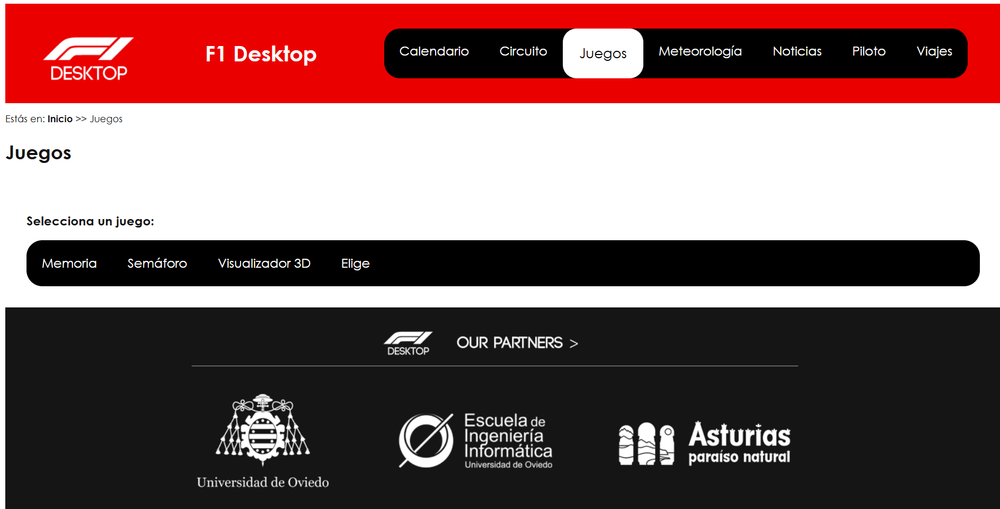  

<sep>  

---  

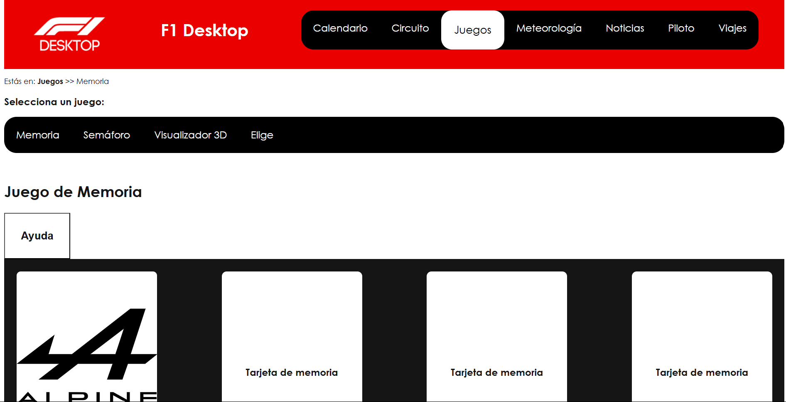  

<sep>  

---  

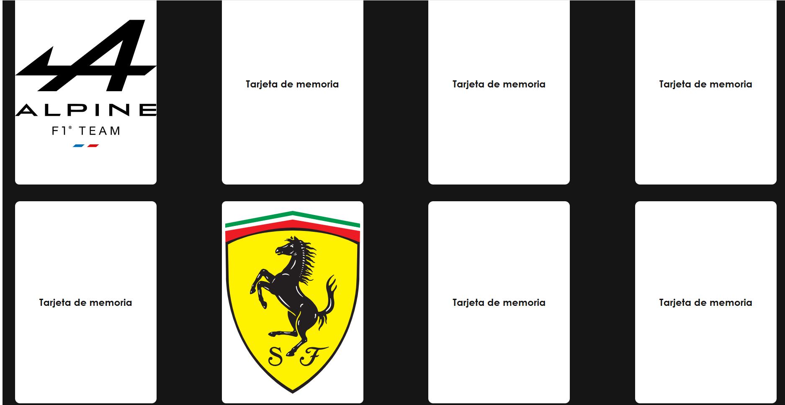  

<sep>  

---  

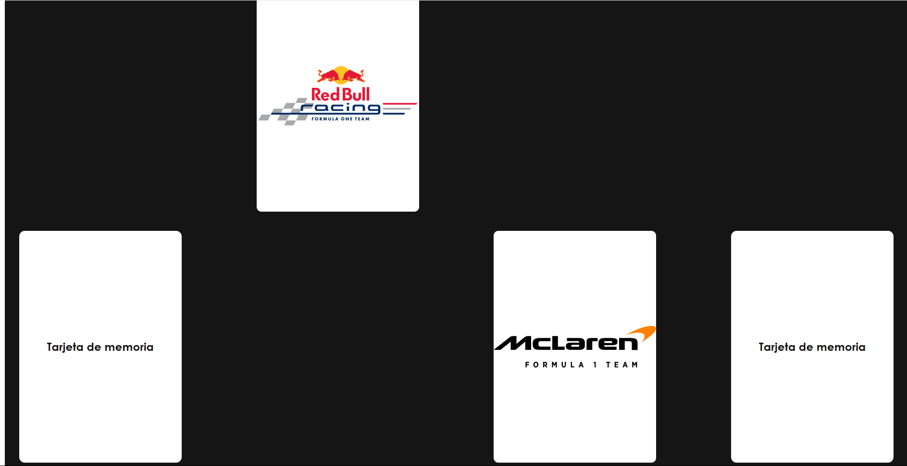  

<sep>  

---  

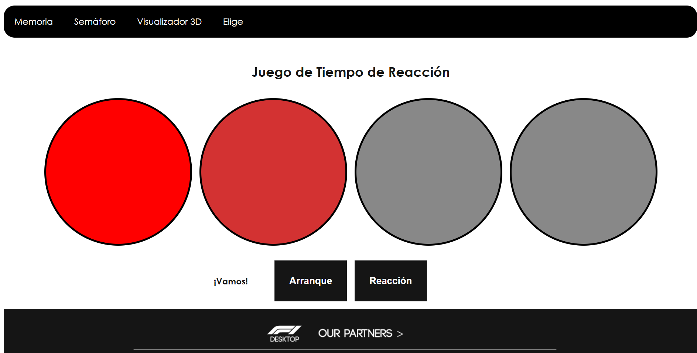  

<sep>  

---  

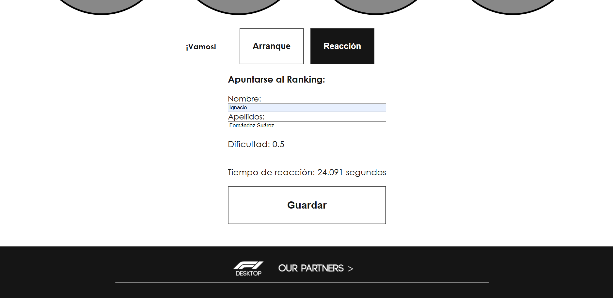  

<sep>  

---  

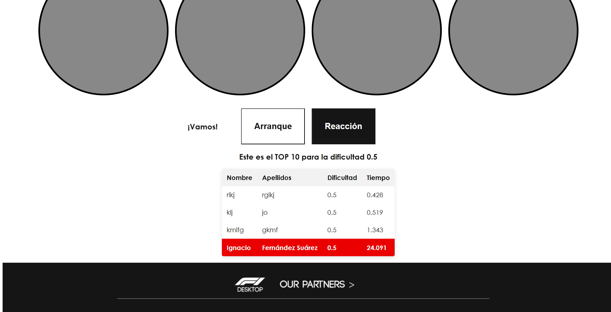  

<sep>  

---  

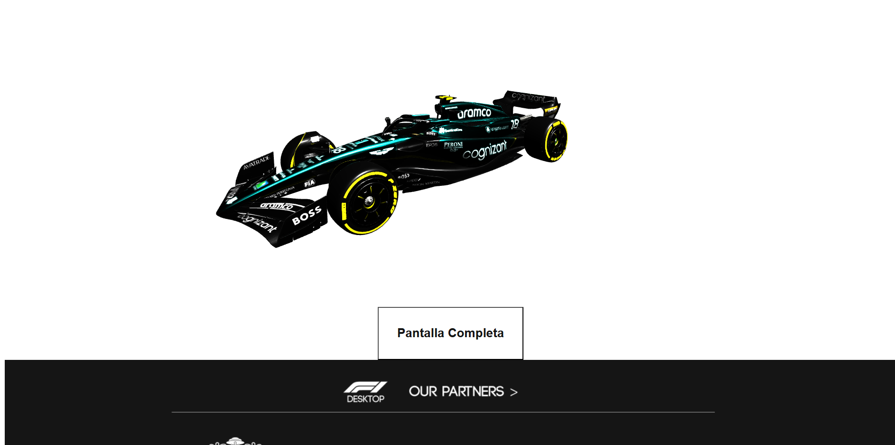  

<sep>  

---  

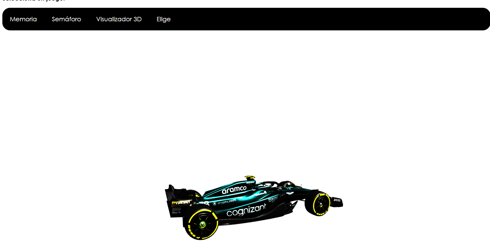  

<sep>  

---  

  

<sep>  

---  

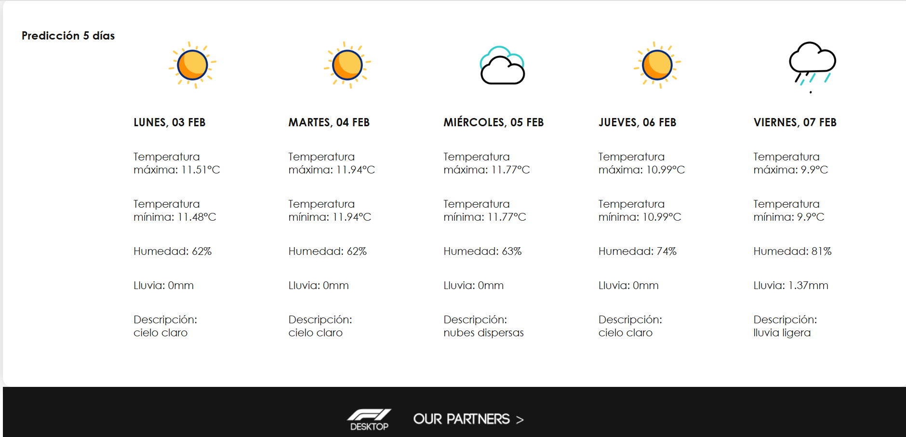  

<sep>  

---  

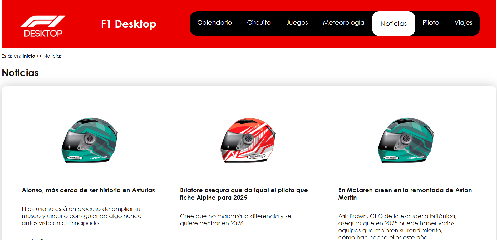  

<sep>  

---  

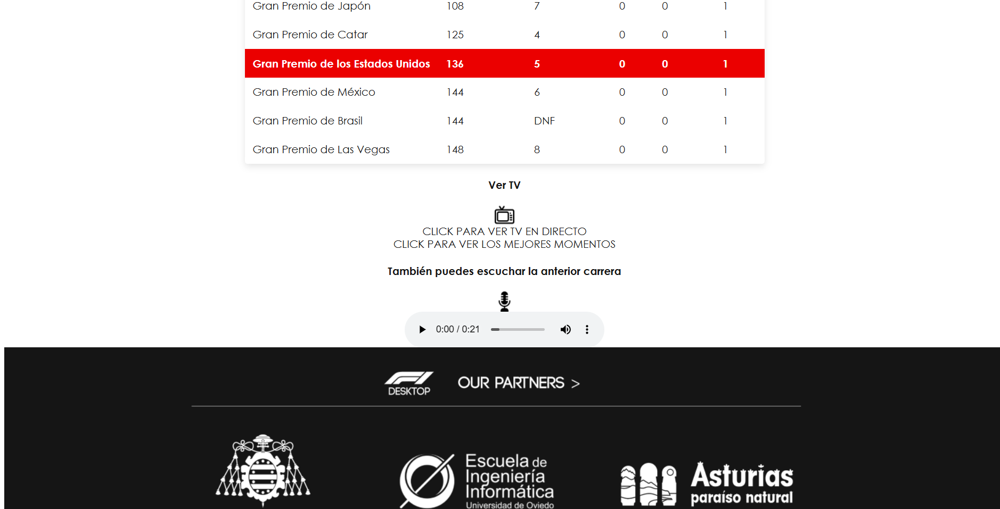  

<sep>  

---  

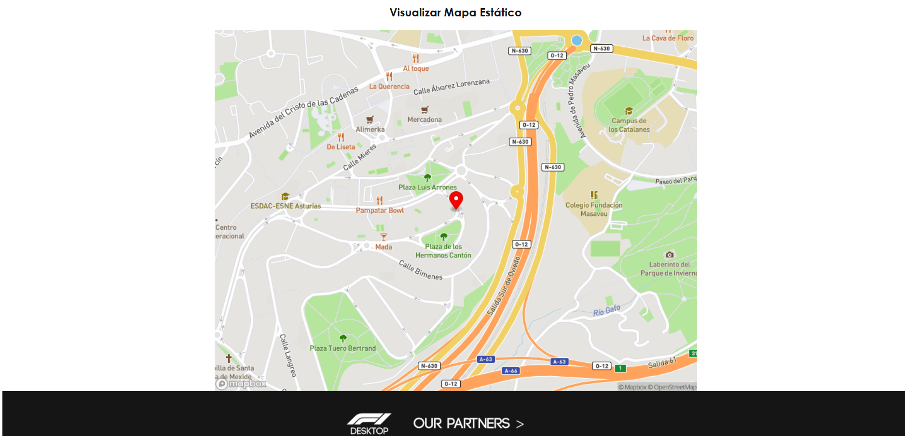  

<sep>  

---  

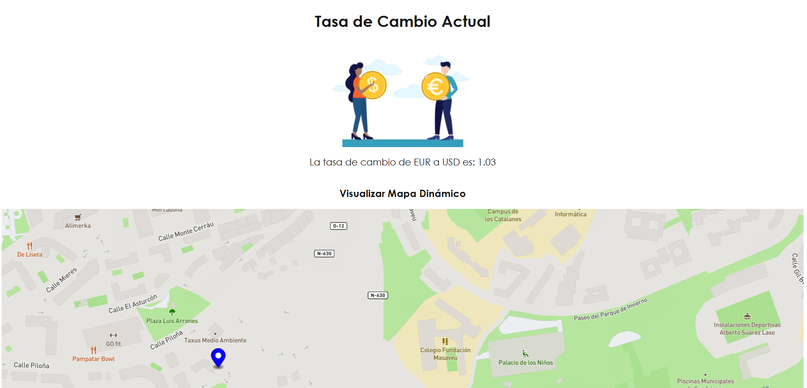  

<sep>  

---  

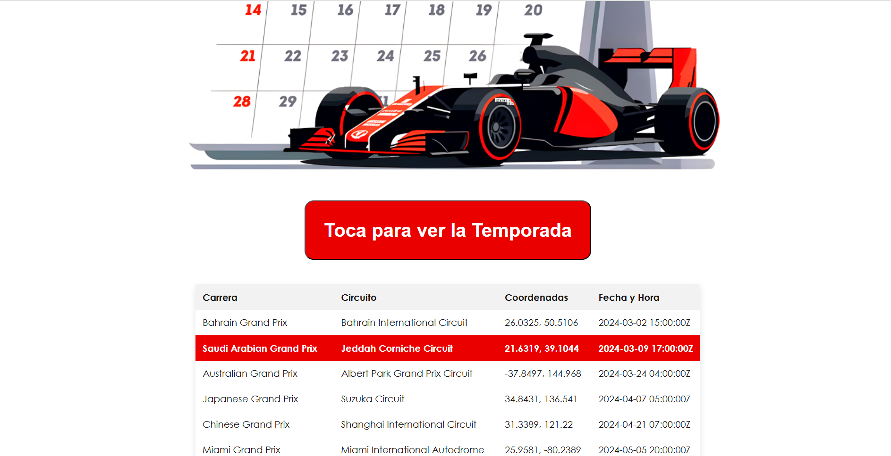  

<sep>  

---  

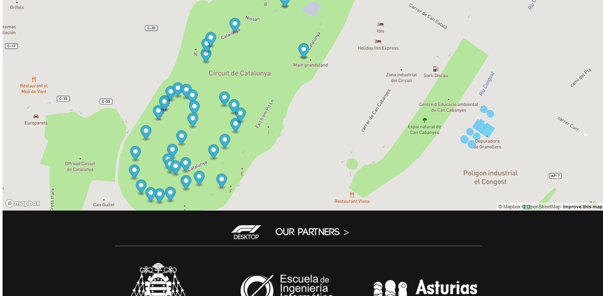  

 

